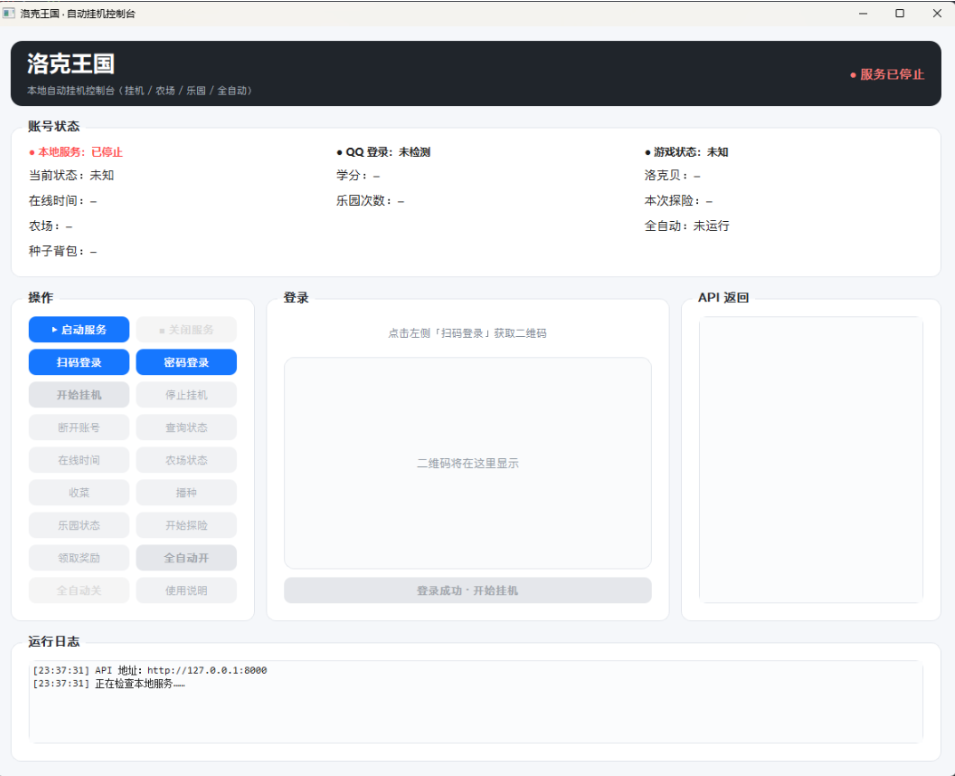

# 洛克王国挂机服务（v3：密码登录 + 农场 + 乐园 + 全自动）

本项目基于github 的 roco-mine-mini-service仓库，实现密码登录全自动挂机，也提供gui，供自己选择

## 一、运行方式

```shell
# python-version >= 3.12 ,最好是3.12 ~ 3.13,  3.14以上的版本可能有bug

uv run main.pygit https://github.com/hungryami/roco-autobank
cd roco-autobank

#填写自己的配置文件
mv config-template.yaml config.yaml
uv sync
#建议看完再运行
uv run main.py
```


项目以 `main.py` 为统一入口（`uv run main.py`），启动时读取根目录 `config.yaml`：

| 配置文件状态 | 行为 |
| --- | --- |
| `login_mode: "password"` 且 `account` / `password` 均非空 | **不启动 GUI**，全后台执行：密码登录 → 自动挂机 → 自动收菜/播种/探险 → 常驻 HTTP 服务（默认 8000） |
| 未配置账号密码（或 `login_mode: "qr"`） | 启动 PySide6 图形界面，界面自动拉起后台服务（端口 8000） |

> 依赖：PySide6 已声明在 `pyproject.toml` 主依赖中，`uv run` 会自动安装；若提示缺少 PySide6，先执行 `uv sync` 再运行。

后台模式日志统一写入项目根 `logs/roco-mini-service.log`（可旋转，单文件 10MB、保留 7 份）；GUI 模式的服务进程日志在 `logs/gui-server.log`。

### 后台模式启动

后台模式适合linux，不使用任何gui，全自动种菜，乐园，银行挂机

```bash
# config.yaml 选择password模式，填上账号和密码
uv run main.py            # config.yaml 有账号密码 → 全后台执行
```

也可以在配置了账号密码的同时强制只启动服务：

```bash
python -m src.roco_mine_mini_service.server --host 127.0.0.1 --port 8000
```

### GUI 模式



把 `config.yaml` 中 `account` / `password` 清空（或 `login_mode: "qr"`），再执行 `python gui.py`。

```bash
# config.yaml 选择qr模式，填上账号和密码
un run main.py            # config.yaml 有账号密码 → 全后台执行
```

## 二、config.yaml 配置项

```yaml
#建议只改登录模式和农场种植植物的id
login_mode: "password"        # 'qr' 二维码 或 'password' 密码
account: "xxx"                # 填自己的QQ 账号（非空时启用后台模式）
password: "xxx"               # 填自己的QQ 密码

# 自动化策略
auto_exit_at_23: true       # 是否在 23:00 自动下线并停止服务进程

# 全自动（仅密码登录的后台模式生效；GUI 内也可手动开启）
auto_start_hang: true       # 自动进入/管理小游戏挂机
auto_farm: true             # 自动收菜 + 自动播种（需退出挂机后执行）
auto_paradise: true         # 自动乐园探险 + 自动领取奖励（挂机中也可执行）
auto_log_interval: 5        # 每隔多少秒写入一条状态日志（洛克贝/在线时间/乐园剩余次数/本次探险倒计时）
farm_interval: 60           # 农场自动巡检间隔（秒）
paradise_interval: 15       # 乐园自动巡检间隔（秒）
hang_minutes: 20            # 每挂机多少分钟后退出挂机去收菜/种菜 (min)
hang_cooldown_minutes: 5    # 退出挂机后等待多少分钟再重新挂机（洛克王国免时挂机约 5 分钟间隔）

# 自动播种优先级（按顺序尝试：先种这个，没有就种fallback_seed_ids(前提是背包有种子)
# 如果都没有的话，最后有个兜底方案，选择背包数量最多的种子播种）
preferred_seed_id: 100728957        # 乖乖蘑菇 https://roco.dvg.cn/ 查询网站
fallback_seed_ids: [100728955]      # 小Q牛轧糖

host: "127.0.0.1"
port: 8000
log_file: "logs/roco-mini-service.log"
```

## 三、全自动模式（密码登录）

密码登录成功后（后台模式默认开启，GUI 中点「全自动开」亦可），自动任务按以下节奏运行：

0. **启动顺序**：查询乐园状态 → 收菜/播种 → 乐园探险 → 自动进入小游戏挂机。
1. **每 5 秒**写一条状态日志到 `logs/roco-mini-service.log`，包含：
   - 当前洛克贝（`洛克贝=1234`）
   - 学分
   - 在线时间（`在线时间=1h19min`）
   - 乐园剩余次数（`乐园剩余次数=3`，每日 `limit - times`，通常每天 8 次）
   - 本次探险倒计时（`本次探险=120秒` / `可领奖` / `空闲`）
2. **挂机管理**（`hang_minutes` 默认 30 分钟）：挂机持续一段时间后**自动退出挂机** → 收菜 + 播种 → 等待 `hang_cooldown_minutes`（默认 5 分钟，洛克王国免时挂机约 5 分钟间隔）→ **重新进入挂机**。
   - 小游戏挂机进行中游戏协议不允许操作农场，所以收菜/播种只会在退出挂机的窗口内执行（`farm_interval` 默认 1h 巡检）。
3. **乐园**（`paradise_interval` 默认 15 秒巡检，实际受探险倒计时约束约 15 分钟一轮）：探险完成（倒计时为 0）自动领奖；空闲且有精灵且当日次数未用完时自动开始新一轮探险。**挂机中乐园也可操作**（HTTP 接口，不依赖场景）。
4. 挂机意外停止时会自动等待冷却后重新挂机。

日志样例：

```
2025-01-01 12:00:05+0800 INFO roco_mini_service automation_status uin=***9568 洛克贝=1234 学分=50 在线时间=1小时0分0秒 乐园剩余次数=3 本次探险=可领奖 状态=running
2025-01-01 12:00:10+0800 INFO roco_mini_service automation_status uin=***9568 洛克贝=1234 学分=50 在线时间=1小时0分5秒 乐园剩余次数=2 本次探险=空闲 状态=running
```

### 自动播种种子优先级（默认已内置）

自动播种按以下优先级选择种子（`config.yaml` 可改）：

1. `preferred_seed_id`：**乖乖蘑菇 `100728957`**（默认值，已内置）
2. `fallback_seed_ids`：**小Q牛轧糖 `100728955`**（默认值，已内置）
3. 兜底：背包中**数量最多**的种子

```yaml
preferred_seed_id: 100728957        # 乖乖蘑菇
fallback_seed_ids: [100728955]      # 小Q牛轧糖
```

> 说明：游戏协议返回的种子背包（`FARM_SEED_INVENTORY`）只有 `seed_id` 与数量、不含名称。以上 ID 是实测数据。`/api/v1/farm` 的 `seeds` 字段、GUI「种子背包」状态栏与日志 `farm_seed_inventory` 都会列出全部种子（十六进制 ID × 数量），如需调整优先级按此修改即可。

## 四、HTTP API

新增接口一律 `message` 字段可直接回复。

### 原接口

| QQ 消息 | 方法 | 路径 | 回复方式 |
| --- | --- | --- | --- |
| 说明 | GET | `/api/v1/help` | 回复 `message` |
| 扫码 | POST | `/api/v1/scan` | 上传 `qr_url` 并回复富媒体 |
| 挂机 | POST | `/api/v1/hang` | 回复 `message` |
| 停止挂机 | POST | `/api/v1/hang/stop` | 停止小游戏挂机，保持游戏连接 |
| 查询 | GET | `/api/v1/status` | 回复 `message` |
| 在线时间 | GET | `/api/v1/online-time` | 回复 `message` |
| 断开 | POST | `/api/v1/disconnect` | 回复 `message` |

### 新增接口

| 指令 | 方法 | 路径 | 说明 |
| --- | --- | --- | --- |
| 密码登录 | POST | `/api/v1/login` | body：`{"account":"QQ号","password":"密码"}` |
| 停止挂机 | POST | `/api/v1/hang/stop` | 只停止小游戏挂机，不断开游戏连接（之后可收菜/播种） |
| 农场 | GET | `/api/v1/farm` | 庄园等级、土地/种子/可收获/空闲数量 |
| 收菜 | POST | `/api/v1/farm/harvest` | 收获所有可收获土地 |
| 播种 | POST | `/api/v1/farm/plant` | body：`{"seed_id":可选}`；不填自动选种子，自动找空地 |
| 乐园 | GET | `/api/v1/paradise` | 等级、精灵数、次数 `times/limit`、剩余次数、本次倒计时 |
| 探险 | POST | `/api/v1/paradise/start` | 开始新一轮探险 |
| 领奖 | POST | `/api/v1/paradise/claim` | 领取已完成探险的奖励 |
| 全自动开 | POST | `/api/v1/automation/start` | body：`{"log_interval":5,"farm":true,"paradise":true,"hang":true,"hang_minutes":30,"hang_cooldown_minutes":5,...}` |
| 全自动关 | POST | `/api/v1/automation/stop` | 停止自动任务 |
| 自动状态 | GET | `/api/v1/automation/status` | 自动任务开关、各计数、最近一条状态日志 |

响应示例（`GET /api/v1/paradise`）：

```json
{
  "status": "ok",
  "message": "乐园等级 9，精灵 3 只，探险次数 2/5（剩余 3 次），本次探险可领奖",
  "level": 9,
  "experience": 321,
  "spirit_count": 3,
  "countdown": 0,
  "participants": 3,
  "times": 2,
  "limit": 5,
  "remaining": 3,
  "updated_at": "2025-01-01T12:00:05+08:00",
  "last_action": "奖励已领取，经验 +10，道具 2 种",
  "last_error": null,
  "last_reward": {"experience": 10, "reward_type": 1, "items": []}
}
```

响应示例（`GET /api/v1/farm`）：

```json
{
  "status": "ok",
  "message": "庄园等级 42，土地 16 块（已种 12，可收获 3，空闲 4），种子 5 种",
  "manor_level": 42,
  "land_count": 16,
  "planted_count": 12,
  "harvestable_count": 3,
  "empty_count": 4,
  "seeds": [{"seed_id": 100769866, "count": 8}],
  "updated_at": "2025-01-01T12:00:00+08:00",
  "last_action": "土地和种子背包已刷新",
  "last_error": null
}
```

响应示例（`GET /api/v1/automation/status`）：

```json
{
  "status": "running",
  "message": "自动任务运行中",
  "active": true,
  "started_at": "2025-01-01T11:59:00+08:00",
  "last_log": "洛克贝=1234 学分=50 在线时间=1h19min 乐园剩余次数=3 本次探险=可领奖 状态=running",
  "log_interval_seconds": 5,
  "farm_enabled": true,
  "paradise_enabled": true,
  "hang_enabled": true,
  "hang_state": "hanging",
  "farm_interval_seconds": 60,
  "paradise_interval_seconds": 15,
  "hang_minutes": 30,
  "hang_cooldown_minutes": 5,
  "harvested": 3,
  "planted": 2,
  "adventures": 1,
  "claims": 1,
  "failures": 0
}
```

`hang_state` 取值：`idle`（未挂机，等待启动）、`hanging`（挂机中）、`cooldown`（已退出挂机，冷却期间收菜/种菜，冷却结束自动重新挂机）。

未登录时新接口统一返回：

```json
{"status": "not_logged_in", "message": "暂未登录"}
```

## 五、GUI 补充说明

- **操作面板**新增：密码登录、停止挂机、农场状态、收菜、播种、乐园状态、开始探险、领取奖励、全自动开 / 关。
  - 「开始挂机」启动小游戏挂机；「停止挂机」只停挂机**不掉线**（之后可收菜/播种/乐园）；「断开账号」停止挂机并断开连接，需重新登录。
- **账号状态栏**新增：乐园次数（已用/上限 + 剩余）、本次探险（倒计时/可领奖/空闲）、农场摘要、种子背包（十六进制 ID × 数量）、全自动运行状态。
- **在线时间**显示为紧凑格式，如 `1h19min`（4740 秒）、`2min`。
- 界面每 5 秒自动刷新乐园与自动任务状态。
- 「密码登录」优先读取 `config.yaml` 的账号密码，未配置时弹出输入框。
- 「播种」不填种子 ID，由服务端自动选择（同后台模式逻辑）。

## 六、密码登录说明

- 实现为 QQ 网页版 ptlogin2 密码流程，与官方登录页（`login_10.js`/`c_login_2.js`）完全对齐：
  1. `xlogin` 获取 `pt_login_sig`
  2. `check`（`pt_tea=2`、`pt_vcode=1`、`js_ver`、`js_type`、`o1vId` 等现代参数）返回 `verifycode / salt / verifysession / isRandSalt / ptdrvs / sessionID`
  3. 密码加密走官方 `getEncryption`：`md5(pwd)`（大写 hex）→ 拼 `salt` 二次 md5 得 TEA key → `TEA-CBC`（腾讯变体）加密 → `RSA-2048 PKCS#1 v1.5` 加密 → base64（`/→-`、`+→*`、`=`→`_`）
  4. `login` 携带 `pt_verifysession_v1`、`pt_randsalt`、`ptdrvs`、`sid`、`pt_guid_sig` 等现代参数提交
  5. 成功后跟随 `check_sig` → OAuth 换取 Roco 凭据（与扫码同一链路）
- 若 `check` 返回需要图形验证码（部分账号受风控），服务会返回错误提示并建议改用扫码模式。
- 密码只保存在 `config.yaml`（本地文件），不会写入日志；日志中 QQ 号仅记录后 4 位。

## 七、目录结构（本次变更部分）

```text
main.py                                   # 统一入口：后台模式 / GUI 分流
config.yaml                              # 账号密码 + 自动化策略
logs/                                    # 后台模式日志（roco-mini-service.log）
src/roco_mine_mini_service/
  config.py                              # 新增：读取 config.yaml
  launcher.py                            # 新增：入口分流（有账号密码→后台，否则→GUI）
  headless.py                            # 新增：全后台执行（登录/挂机/自动化/服务）
  qq_login.py                            # 扩展：QQPasswordLoginFlow 密码登录
  service.py                             # 扩展：农场/乐园/密码登录/自动化任务
  server.py                              # 扩展：/api/v1/login、/farm、/paradise、/automation
  game_sessions.py                       # 原有：农场/乐园协议执行（本次直接复用）
```

## 八、测试

```bash
.venv/Scripts/python -m pytest -q
```

覆盖原有扫码/状态/在线时间/掉线/协议报文用例，并新增：密码登录、`/api/v1/farm`、`/api/v1/paradise`、`/api/v1/automation` 端点与自动化启动前置校验。


请在继续下载、安装或使用本项目（以下简称“本项目”）前，仔细阅读以下条款。**任何使用本项目的行为，均视为你已无条件接受并同意本声明的所有条款。**

1. **仅供学习与交流**
   - 本项目仅供软件开发、网络协议分析及自动化技术的研究与学习使用，切勿用于任何商业用途或非法用途。
2. **版权与资产归属**
   - 本项目涉及的所有游戏/平台名称、商标、图片、协议及相关资产，其版权及知识产权均归其对应的版权方（如腾讯公司等）所有。本项目与版权方无任何关联、赞助或合作关系。
3. **使用者风险自负**
   - 本项目以“按现状”（As Is）形式提供，作者不对软件的稳定性、安全性、完整性或特定用途的适用性作任何明示或暗示的保证。
   - **使用本自动化脚本或工具可能存在被目标平台封号、限制登录、风控校验等风险。** 用户须自行承担因使用本项目所产生的一切直接或间接后果（包括但不限于账号被封禁、游戏资产损失、数据丢失等），项目作者及贡献者概不承担任何法律责任或经济赔偿责任。
4. **隐私与安全**
   - 本项目承诺不包含任何恶意后门代码。所有配置文件（如 `.env`、`config.yaml` 等）及敏感数据（如账号密码、Token）均仅保存在本地设备，请妥善保管你的本地凭据，切勿将其提交至公共代码仓库。
5. **遵纪守法**
   - 请在遵守当地法律法规以及相关平台服务协议的前提下使用本项目。若你所在地区的法律或目标平台禁止使用此类软件，请立即停止使用并删除本项目。
